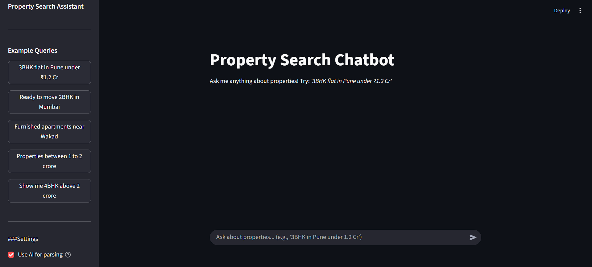

# 🏠 NoBrokerage Property Chatbot

An intelligent, ChatGPT-like property search interface powered by AI. Search for properties using natural language instead of complex filters!


---

## 🎯 Features

- **Natural Language Search** - Just describe what you want: *"3BHK flat in Pune under ₹1.2 Cr"*
- **AI-Powered Understanding** - Uses LangChain + Hugging Face LLM to understand your query
- **Intelligent Search** - Automatically expands search if results are too few
- **Beautiful UI** - ChatGPT-like interface built with Streamlit
- **Smart Summaries** - AI-generated summaries of search results
- **Property Cards** - Beautiful cards with all property details
- **Real-time Filtering** - Search by BHK, city, budget, status, furnishing, and more

---

## 🚀 Quick Start

### 1. Clone the Repository

```bash
git clone https://github.com/yourusername/property-chatbot.git
cd property-chatbot
```

### 2. Install Dependencies

```bash
pip install -r requirements.txt
```

### 3. Set Up Environment Variables

Create a `.env` file in the project root:

```bash
# Get your API key from: https://huggingface.co/settings/tokens
HUGGINGFACE_API_KEY=hf_your_actual_key_here
```

### 4. Add Your Data

Place your CSV files in the `data/` folder:
- `project.csv`
- `ProjectAddress.csv`
- `ProjectConfiguration.csv`
- `ProjectConfigurationVariant.csv`

### 5. Run the App

```bash
streamlit run app.py
```

The app will open in your browser at `http://localhost:8501`

---

## 📁 Project Structure

```
property-chatbot/
│
├── data/                           # CSV data files
│   ├── project.csv
│   ├── ProjectAddress.csv
│   ├── ProjectConfiguration.csv
│   └── ProjectConfigurationVariant.csv
│
├── app.py                          # Main Streamlit application
├── data_loader.py                  # Load and merge CSV files
├── query_parser.py                 # Extract filters from natural language (LangChain)
├── search_engine.py                # Search and filter properties
├── response_generator.py           # Generate summaries and format results (LangChain)
│
├── requirements.txt                # Python dependencies
├── .env                           # Environment variables (API keys)
├── README.md                      # This file
```

---

## 🎨 Screenshots

### Chat Interface


---

## 🔧 How It Works

### Architecture

```
User Query: "3BHK flat in Pune under ₹1.2 Cr"
                    ↓
┌─────────────────────────────────────────────┐
│  1. Query Parser (LangChain + HuggingFace) │
│     Extracts: bhk='3', city='pune',        │
│     max_price_cr=1.2                       │
└─────────────────────────────────────────────┘
                    ↓
┌─────────────────────────────────────────────┐
│  2. Search Engine                           │
│     Filters database using extracted params │
│     Returns: 12 matching properties         │
└─────────────────────────────────────────────┘
                    ↓
┌─────────────────────────────────────────────┐
│  3. Response Generator (LangChain)          │
│     Generates natural language summary      │
│     Formats property cards                  │
└─────────────────────────────────────────────┘
                    ↓
┌─────────────────────────────────────────────┐
│  4. Streamlit UI                            │
│     Displays chat interface with results    │
└─────────────────────────────────────────────┘
```

### Key Technologies

- **Streamlit** - Beautiful web interface
- **LangChain** - LLM orchestration and prompt management
- **Hugging Face** - LLM for natural language understanding
- **Pandas** - Data processing and filtering
- **Pydantic** - Data validation

---

## 💡 Example Queries

Try these in the chatbot:

- `3BHK flat in Pune under ₹1.2 Cr`
- `Show me 2 bedroom apartments in Mumbai below 80 lakhs`
- `Ready to move 3BHK near Wakad`

---

## 🎯 Features in Detail

### 1. Natural Language Understanding

Uses LangChain with Hugging Face LLM to understand:
- **BHK Types**: "3BHK", "2 bedroom", "three bhk"
- **Cities**: "Pune", "Mumbai", "Bangalore"
- **Budget**: "under 1.2 crore", "below 80 lakhs", "between 1-2 Cr"
- **Status**: "ready to move", "under construction"
- **Furnishing**: "furnished", "semi furnished", "unfurnished"
- **Location**: "near Wakad", "in Baner"
- **Area**: "above 1000 sqft"

### 2. Intelligent Search

- Filters properties based on extracted parameters
- Ranks results by relevance
- Automatically expands search if too few results
- Handles missing data gracefully

### 3. Smart Summaries

AI-generated summaries that include:
- Total properties found
- Price range and average
- Top localities
- Ready vs under construction split
- Key highlights

### 4. Beautiful Property Cards

Each card displays:
- Property name and BHK type
- Price (in Crores or Lakhs)
- Location/locality
- Carpet area
- Status (Ready/Under Construction)
- Furnishing type
- Bathrooms, lift, parking
- Visual badges and emojis

---

## ⚙️ Configuration

### Change LLM Model

In `.env` file:

```bash
# Faster, smaller model
HF_MODEL_NAME=mistralai/Mistral-7B-Instruct-v0.2

# More powerful model
HF_MODEL_NAME=mistralai/Mixtral-8x7B-Instruct-v0.1

# Default (recommended)
HF_MODEL_NAME=meta-llama/Meta-Llama-3-8B-Instruct
```

### Disable LLM (Use Regex Fallback)

In `query_parser.py`:

```python
filters = parse_user_query(query, use_llm=False)
```

---

## 🚀 Deployment

### Deploy to Streamlit Cloud

1. Push code to GitHub
2. Go to [share.streamlit.io](https://share.streamlit.io)
3. Connect your GitHub repo
4. Add secrets in Streamlit dashboard:
   ```
   HUGGINGFACE_API_KEY = "hf_your_key_here"
   ```

---

## 📧 Contact

For questions or support:
- Email: rohitbisht2360@gmail.com

---

**Tech Stack Used:**
- Python 3.9+
- Streamlit (UI)
- LangChain (LLM orchestration)
- Hugging Face (NLP models)
- Pandas (Data processing)

---

Made with ❤️ using Streamlit, LangChain, and Hugging Face